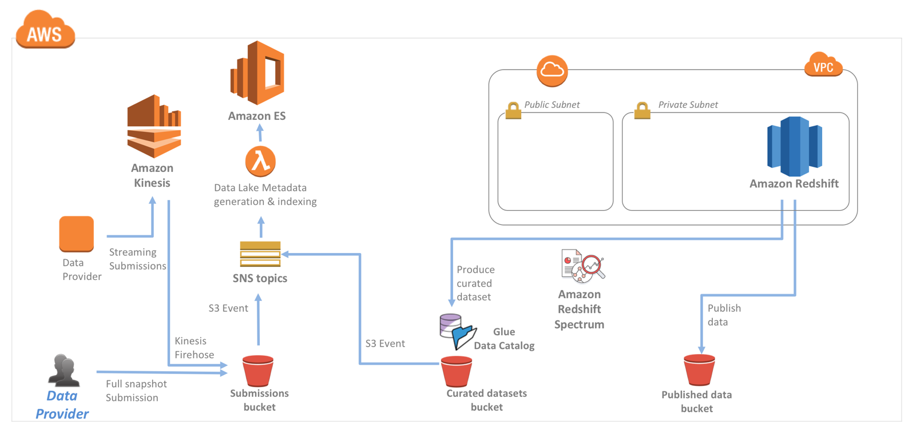

// Add steps as necessary for accessing the software, post-configuration, and testing. Don’t include full usage instructions for your software, but add links to your product documentation for that information.
//Should any sections not be applicable, remove them

== Test the deployment
Confirm the following:

* The S3 buckets listed on the *Outputs* tab for the stack are available in the Amazon S3 console. The Quick Start provisions distinct S3 buckets for submissions, curated datasets, and published results.
* If you launched the Quick Start with *Enable Redshift* set to *yes*, Amazon Redshift is accessible from the Java Database Connectivity (JDBC) endpoint specified on the *Outputs* tab for the stack. For the user name and password, use the values that you specified when you launched the Quick Start.
* Kinesis streaming submissions on the stack's *Outputs* tab is available in the Kinesis console.
* The Amazon Elasticsearch Service (Amazon ES) cluster listed on the *Outputs* tab for the stack is available in the Amazon ES console. 
* The Kibana endpoint listed on the *Outputs* tab is accessible from a web-browser client within the remote-access CIDR that you specified when you launched the Quick Start.

== Optional: Using your own dataset
The Data Lake Foundation provides a base for your processes. Use this infrastructure for the following:

* Ingest batch submissions, which results in curated Amazon S3 datasets. You can then use your own SQL scripts to load curated datasets into Amazon Redshift.
* Ingest streaming submissions from Amazon Kinesis Data Firehose.
* Auto-discover curated datasets using AWS Glue crawlers, and transform curated datasets using AWS Glue jobs.
* Use your own SQL queries to analyze Amazon Redshift data.
* Analyze your data with Amazon Kinesis Data Analytics by creating your own applications that read streaming data from Kinesis Data Firehose.
* Publish the results of analytics to the published datasets bucket.
* Get a high-level picture of your data lake by using Amazon ES, which indexes the metadata of S3 objects.
* Use Amazon Athena to run ad hoc analytics on your curated datasets and Amazon QuickSight to visualize the datasets in the published datasets bucket. You can also use Amazon Athena or Amazon Redshift as data sources for Amazon QuickSight.

[#architecture5]
.Infrastructure deployed when launching Quick Start
[link=images/image5.png]

== Optional: Adding VPC definitions
When you launch the deployment option that creates a new VPC, the Quick Start uses VPC parameters that are mapped within the AWS CloudFormation templates. If download the templates from the GitHub repository, you can add new VPC definitions to the mapping and choose one of the named VPC definitions when you launch the Quick Start.

The following table shows the parameters within each VPC definition. You can create as many VPC definitions as you need within your environments. When you deploy the Quick Start, use the VPC *Definition* parameter to specify the configuration you want to use.

|===
|Parameter |Default |Description

// Space needed to maintain table headers
|NumberOfAZs |2 |Number of Availability Zones to use in the VPC. 
|PrivateSubnet1CIDR |10.0.2.0/24 |CIDR block for private subnet 1, located in Availability Zone 1.
|PrivateSubnet2CIDR |10.0.4.0/24 |CIDR block for private subnet 2, located in Availability Zone 2.
|PublicSubnet2CIDR |10.0.3.0/24 |CIDR block for the public (DMZ) subnet 2, located in Availability Zone 2.
|PublicSubnet1CIDR |10.0.1.0/24 |CIDR block for the public (DMZ) subnet 1, located in Availability Zone 1.
|VPCCIDR |10.0.0.0/16 |CIDR block for the VPC.
|===
