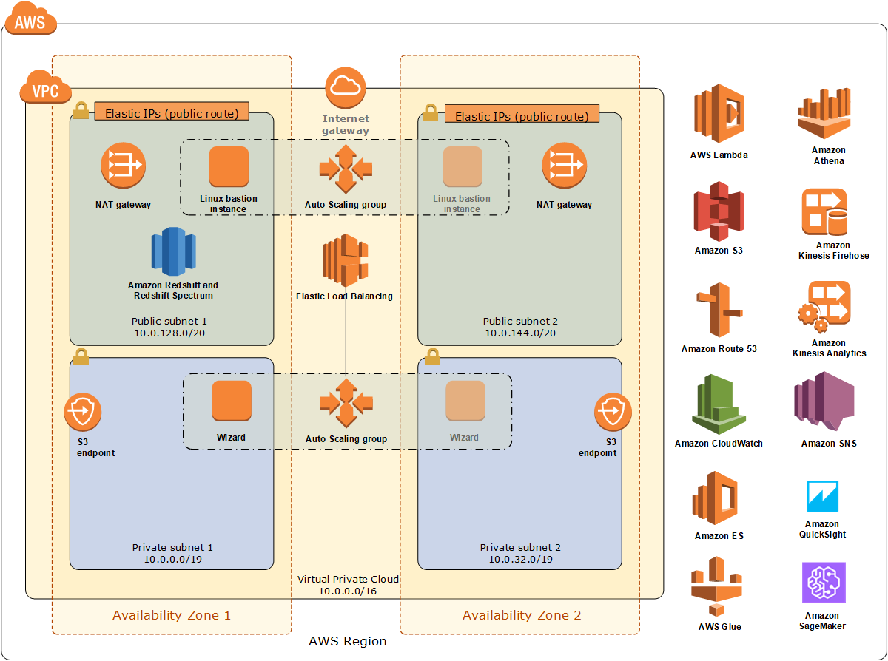

Deploying this Quick Start for a new virtual private cloud (VPC) with
default parameters builds the following _{partner-product-name}_ environment in the AWS Cloud.

// Replace this example diagram with your own. Send us your source PowerPoint file. Be sure to follow our guidelines here : http://(we should include these points on our contributors giude)
[#architecture1]
.Quick Start architecture for _{partner-product-name}_ on AWS
[link=images/architecture_diagram.png]

As shown in figure 1, the Quick Start sets up the following:

* A virtual private cloud (VPC) that spans two Availability Zones and includes two public and two private subnets.*
* An internet gateway to allow access to the internet.*
* In the public subnets:
    - Managed network address translation (NAT) gateways to allow outbound internet access for resources in the private subnets.*
    - Linux bastion hosts in an Auto Scaling group to allow inbound Secure Shell (SSH) access to Amazon Elastic Compute Cloud (Amazon EC2) instances in public and private subnets.*
    - Amazon Redshift and Redshift Spectrum for data aggregation, analysis, transformation, and creation of curated and published datasets.
* In the private subnets:
    - An Amazon S3 endpoint.
    - The Data Lake wizard.
* AWS Identity and Access Management (IAM) roles to provide permissions to access AWS resources (for example, to permit Amazon Redshift and Amazon Athena to read and write curated datasets).
* An Amazon SageMaker instance, which you can access by using AWS authentication.
* Integration with other Amazon services, such as Amazon S3, Amazon Athena, AWS Glue, AWS Lambda, Amazon ES with Kibana, Amazon Kinesis, and Amazon QuickSight.

+*+ The template that deploys the Quick Start into an existing VPC skips the components marked by asterisks and prompts you for your existing VPC configuration.

The following figure shows how these components work together in a typical end-to-end process flow.

[#architecture2]
.Data lake foundation process flow
[link=images/image2.png]
image::../images/image2.png[Architecture,width=648,height=439]
